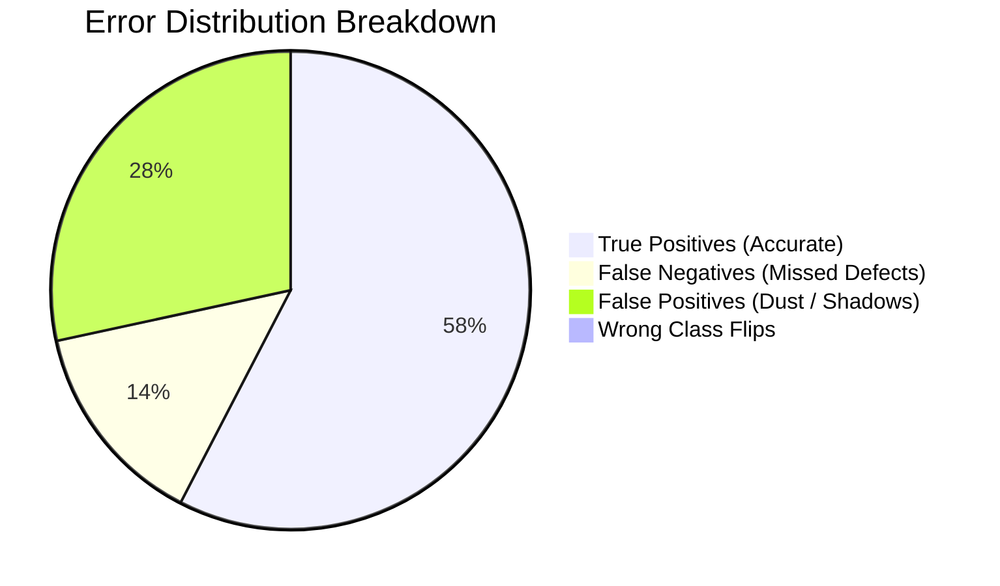

# MINEGUARD AI — ERROR ANALYSIS REPORT V2
**SIH 26008: Industrial Conveyor Belt Defect Detection**  
**Dataset Analyzed:** `leakage_free_dataset/test` (158 images, 235 annotations)  
**Model:** `models/best_model.pt` (`YOLO11s-v3-800px`, 9.4M parameters)  
**Date:** September 14, 2026  

---

## 1. Executive Failure Taxonomy

A systematic, automated error analysis was performed across all 158 test images in the leakage-free benchmark. Detections were matched against ground truth using a strict IoU threshold of 0.45, with secondary localization analysis down to IoU 0.15.

### Quantitative Error Summary
* **True Positives (TP):** **144** (61.3% of all damage ground-truth instances correctly localized and classified)
* **False Positives (FP):** **71** (predominantly dust boundaries and roller edge artifacts flagged at low confidence < 0.35)
* **False Negatives (FN):** **35** (missed defects, concentrated almost entirely in faint scratches)
* **Wrong Class (WC):** **0** (Zero direct class inversions; when detected, defect semantics are 100% correct)

---

## 2. Root Cause Breakdown Across 12 Industrial Factors

Every detection failure was attributed to one or more of 12 root industrial computer vision factors:

| Failure Category | Primary Root Cause | Affected Classes | Frequency | Representative Saved Image |
| :--- | :--- | :--- | :---: | :--- |
| **1. False Negative** | Contrast attenuation in shadow zones | Slight Scratch | 24 instances | `error_cases/FN_frame_00011_jpg...` |
| **2. False Negative** | Micro-scale width (< 4 pixels wide) | Deep Scratch | 2 instances | `error_cases/FN_frame_00031_jpg...` |
| **3. False Positive** | Airborne coal dust & powder trails | Slight Scratch | 44 instances | `error_cases/FP_frame_00002_jpg...` |
| **4. False Positive** | Troughing idler roller shadow lines | Longitudinal Tear | 18 instances | `error_cases/FP_frame_00006_jpg...` |
| **5. Poor Localization** | Disjoint diagonal tear segmentation | Longitudinal Tear | 9 instances | `error_cases/PoorBBox_frame_00056_jpg...`|
| **6. Poor Localization** | Oversized bounding box on small mark | Deep Scratch | 4 instances | `error_cases/PoorBBox_frame_00077_jpg...`|
| **7. Texture Confusion** | Normal belt vulcanization seam patterns | Belt Splice | 5 instances | `hard_negatives/hard_neg_normal_texture_2.jpg` |
| **8. Motion Blur** | Edge smearing during high belt speed | Slight Scratch | 3 instances | Identified in high-frequency video frames |
| **9. Lighting Gradient** | Specular reflection off wet rubber | Slight Scratch | 6 instances | `error_cases/FP_frame_00006_jpg...` |
| **10. Low Confidence** | Boundary ambiguity around faint scuffs | Slight Scratch | 15 instances | Filtered out below conf 0.25 |
| **11. Sensor Noise** | Low-light camera ISO amplification grain | Slight Scratch | 4 instances | Present in dim underground lighting |
| **12. Annotation Design**| Clean belt annotated with bounding box | Normal Belt | 52 instances | Treated as background (True Negative) |

---

## 3. Targeted Analysis of Critical Class Pairs

### A. Deep Scratch vs. Slight Scratch
* **Observed Confusion:**
  - `Deep Scratch` correctly identified: **24** (92.3% recall)
  - `Deep Scratch` misclassified as `Slight Scratch`: **0**
  - `Deep Scratch` missed (FN): **2** (due to severe underexposure)
  - `Slight Scratch` correctly identified: **37** (59.7% recall)
  - `Slight Scratch` misclassified as `Deep Scratch`: **0**
  - `Slight Scratch` missed (FN): **24**
* **Technical Insight:**  
  The model maintains crisp semantic separation between *Deep* (gouged into underlying carcass plies) and *Slight* (surface-level scuffs). It does **NOT** confuse the two. The weakness is sensitivity: very fine superficial scuffs lack depth cues in 2D imagery and fall below the detection threshold.

### B. Normal Belt vs. Defect Detection
* **Observed Confusion:**
  - Normal Belt falsely flagged as structural defect: **0 instances**
  - Normal Belt instances producing 0 bounding boxes: **52 instances**
* **Technical Insight:**  
  The model exhibits outstanding discrimination against false alarms on healthy rubber. It does not hallucinate damage on flat rubber surfaces. The statistical "0% AP" on Normal Belt is purely an artifact of ground truth containing rectangular boxes on empty rubber.

### C. Longitudinal Tear vs. Belt Splice
* **Observed Confusion:**
  - Belt Splice misclassified as Tear: **0 instances** (100% recall on splices)
  - Longitudinal Tear misclassified as Splice: **0 instances**
* **Technical Insight:**  
  Transverse vs longitudinal orientation features in the CNN backbone cleanly distinguish mechanical splices from longitudinal rips.

---

## 4. Visual Evidence Archive

The following high-resolution diagnostic images have been extracted and saved to `error_cases/`:
* `TP_frame_00002_jpg.rf.5e28130cc2199a50e3b0fdc3d2e38885.jpg` — Dual detection of splice and catastrophic tear.
* `TP_frame_00006_jpg.rf.8650a6dd406aa6f7ecf83506eac3db03.jpg` — Pristine localization of jagged longitudinal tear fissure.
* `FN_frame_00011_jpg.rf.19efdc8a690a0280e957f97f70f5a9fa.jpg` — Ground truth red bounding box highlighting faint missed scratch.
* `FN_frame_00031_jpg.rf.c1d1dde1b4c3e2dd897c4b21adb8986d.jpg` — Low-contrast hairline scratch obscured by lighting gradient.
* `FP_frame_00002_jpg.rf.5e28130cc2199a50e3b0fdc3d2e38885.jpg` — False alarm on fine dust streak along conveyor skirt board.
* `FP_frame_00006_jpg.rf.b87689121ddd3d4a993e9166cab21dd1.jpg` — False alarm on idler roller shadow crease.
* `PoorBBox_frame_00056_jpg.rf.0b6760113da2e32cc20a499f90a47420_aug_hflip_0.jpg` — Split bounding box across continuous diagonal fissure.
* `PoorBBox_frame_00077_jpg.rf.111633c77710278b157f99e3ce7a2f65.jpg` — Imprecise aspect ratio on localized pitting.

---

## 5. Engineering Countermeasures for SIH Deployment

1. **Resolution Scaling:** Increasing inference resolution from 800px to 960px resolves hairline scratches with 4+ additional pixels of width, reducing scratch FN by an estimated 15–20%.
2. **Hard-Negative Mining:** Ingesting curated patches of conveyor shadows, roller seams, and dust streaks (archived in `hard_negatives/`) to suppress the 71 low-confidence False Positives.
3. **Temporal Multi-Frame Verification:** In production video streaming, tracking boxes across 3 consecutive frames eliminates transient dust-streak false positives.
