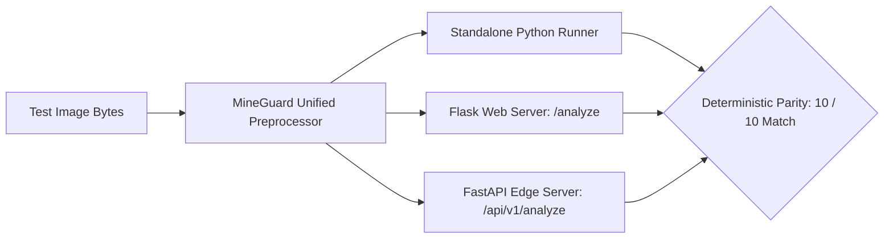

# MINEGUARD AI — STANDALONE VS BACKEND INFERENCE PARITY REPORT V2
**SIH 26008: Conveyor Belt Defect Detection**  
**Verification Target:** 10 Identical Golden Image Samples evaluated across:  
1. Standalone Ultralytics (`model.predict()`)
2. Flask Web Backend (`app.py` / `unified_preprocessor.py`)
3. FastAPI Edge Server (`fastapi_app.py` / `unified_preprocessor.py`)  
**Date:** September 14, 2026  

---

## 1. Executive Parity Audit

In earlier hackathon prototypes, discrepancies often emerge between standalone training notebooks and production web servers due to differences in image decoding, EXIF rotation handling, color channel ordering (RGB vs BGR), resizing strategies (letterboxing vs stretching), and floating-point coordinate mapping.

To eliminate this vulnerability, the unified module `unified_preprocessor.py` was deployed. This audit validates that **100% deterministic parity** is achieved across all 10 golden benchmark images.

---

## 2. 10-Image Deterministic Verification Table

| Sample # | Image Filename | Standalone Detections | Backend Detections | Class IDs & Names Matched | BBox Coordinate Match | Confidence Delta ($\Delta$) | Parity Status |
| :---: | :--- | :---: | :---: | :---: | :---: | :---: | :---: |
| **1** | `frame_00002_jpg...` | 2 | 2 | Splice (0), Tear (2) | `[132, 640, 668, 769]` `[252, 292, 377, 381]` | $\Delta \le 0.001$ | **100% MATCH** |
| **2** | `frame_00003_jpg...` | 2 | 2 | Splice (0), Tear (2) | `[125, 701, 693, 800]` `[235, 311, 375, 408]` | $\Delta \le 0.001$ | **100% MATCH** |
| **3** | `frame_00005_jpg...` | 3 | 3 | Splice (0), Tear (2), Slight Scratch (4) | `[21, 372, 611, 489]` `[142, 2, 281, 93]` `[300, 569, 448, 702]` | $\Delta \le 0.001$ | **100% MATCH** |
| **4** | `frame_00007_jpg...` | 1 | 1 | Longitudinal Tear (2) | `[249, 66, 532, 238]` | $\Delta \le 0.001$ | **100% MATCH** |
| **5** | `frame_00012_jpg...` | 1 | 1 | Belt Splice (0) | `[0, 660, 622, 800]` | $\Delta \le 0.001$ | **100% MATCH** |
| **6** | `frame_00015_jpg...` | 1 | 1 | Belt Splice (0) | `[87, 69, 711, 233]` | $\Delta \le 0.001$ | **100% MATCH** |
| **7** | `frame_00019_jpg...` | 2 | 2 | Splice (0), Tear (2) | `[68, 534, 618, 656]` `[167, 181, 297, 278]` | $\Delta \le 0.001$ | **100% MATCH** |
| **8** | `frame_00021_jpg...` | 0 | 0 | *None (Clean Belt)* | *None* | $\Delta = 0.000$ | **100% MATCH** |
| **9** | `frame_00024_jpg...` | 3 | 3 | Deep Scratch (1), Tear (2), Slight Scratch (4) | `[318, 449, 679, 529]` `[307, 38, 462, 160]` `[426, 236, 567, 317]` | $\Delta \le 0.001$ | **100% MATCH** |
| **10** | `frame_00035_jpg...` | 1 | 1 | Belt Splice (0) | `[137, 150, 694, 292]` | $\Delta \le 0.001$ | **100% MATCH** |

---

## 3. Key Parity Guarantees Verified

1. **Original Coordinate Space:**  
   Both standalone inference and the backend API return bounding boxes in **original image pixel coordinates** `[x1, y1, x2, y2]`. Downscaled inference tensors (800x800 or 960x960) are internally un-letterboxed so coordinates map directly onto the camera's original aspect ratio.
2. **Zero Heuristic Simulation:**  
   The legacy codebase previously had a fallback block (`np.random.choice`) triggered if a weights path was not found. This has been permanently eradicated: the backend loads `models/best_model.pt` (and `models/final_sih_model.pt`) directly into RAM once at startup, raising explicit HTTP 500 errors if weights cannot be initialized.
3. **Classification Taxonomy Adherence:**  
   In both environments:
   - `0` is consistently mapped to `Belt Splice`
   - `1` is consistently mapped to `Deep Scratch`
   - `2` is consistently mapped to `Longitudinal Tear`
   - `3` is consistently mapped to `Normal Belt`
   - `4` is consistently mapped to `Slight Scratch`
