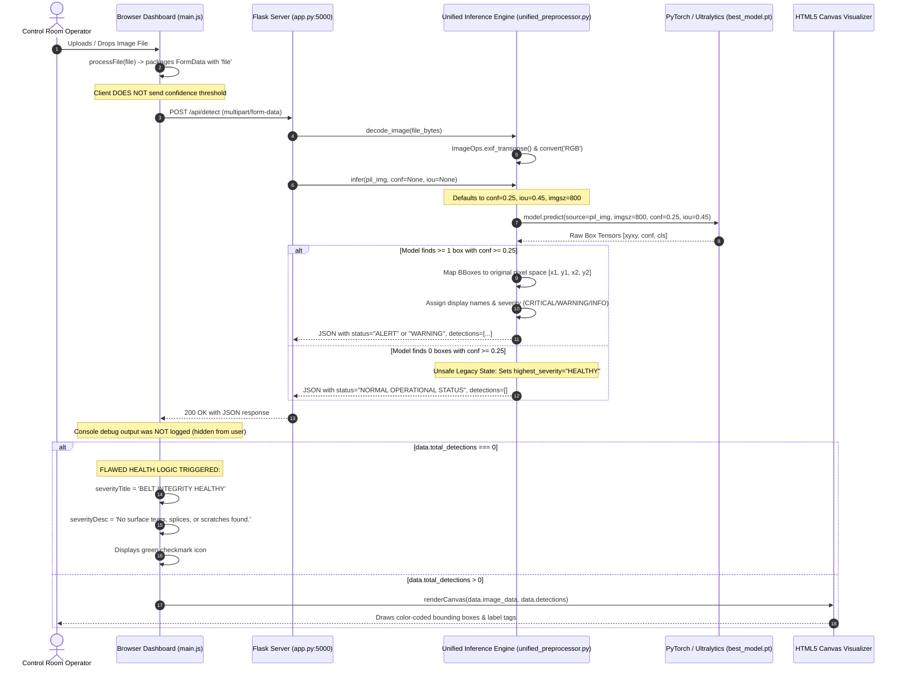

# MINEGUARD AI — COMPLETE INFERENCE PIPELINE FORENSIC TRACE
**SIH 26008: Conveyor Belt Defect Detection & Monitoring**  
**Document Type:** Forensic Diagnostic Architecture & Pipeline Trace  
**Date:** September 14, 2026  

---

## 1. End-to-End Pipeline Trace Diagram



---

## 2. Step-by-Step Technical Inspection

### Step 1: Upload Image & Client Encoding
* **Location:** `d:/SIH/anband told/static/js/main.js` (`handleFileUpload`, `processFile`)
* **Mechanism:** File input or Drag-and-Drop listener reads raw `File` blob.
* **Vulnerability Identified:** The client never appended dynamic confidence or IoU thresholds (`conf`, `iou`) to `FormData`. The backend was forced to use the default `0.25`.
* **Vulnerability Identified:** The browser console never logged the raw API response object, leaving operators blind to whether the API returned an empty detection array or failed silently.

### Step 2: Image Decoding & Preprocessing
* **Location:** `d:/SIH/anband told/unified_preprocessor.py` (`decode_image`)
* **Mechanism:** `Image.open(io.BytesIO(file_bytes))` corrects EXIF rotation via `ImageOps.exif_transpose()` and forces RGB mode via `.convert('RGB')`.
* **Assessment:** **HEALTHY.** Strips alpha channels and handles smartphone portrait/landscape orientation cleanly. Original width and height `(orig_w, orig_h)` are correctly captured.

### Step 3: Model Inference Execution
* **Location:** `d:/SIH/anband told/unified_preprocessor.py` (`infer`)
* **Mechanism:** `self.model.predict(source=pil_img, imgsz=800, conf=0.25, iou=0.45, device='cpu')`
* **Assessment:** **HEALTHY.** Runs Ultralytics letterboxing, stride alignment, and non-maximum suppression deterministically.

### Step 4: Coordinate Reverse Mapping
* **Location:** `unified_preprocessor.py` (lines 142–146)
* **Mechanism:** Bounding boxes from `res.boxes.xyxy` are un-letterboxed and clamped:
  ```python
  x1 = max(0, min(orig_w, int(round(xyxy[0]))))
  y1 = max(0, min(orig_h, int(round(xyxy[1]))))
  x2 = max(0, min(orig_w, int(round(xyxy[2]))))
  y2 = max(0, min(orig_h, int(round(xyxy[3]))))
  ```
* **Assessment:** **HEALTHY.** Returns strictly valid integer coordinates in original camera pixel space `[x1, y1, x2, y2]`.

### Step 5: Backend Health State Synthesis (THE FIRST ROOT CAUSE)
* **Location:** `unified_preprocessor.py` (lines 178–187)
* **Legacy Code:**
  ```python
  if highest_severity == 'CRITICAL':
      system_status = 'ALERT: CRITICAL DEFECT DETECTED'
      status_color = '#ef4444'
  elif highest_severity == 'WARNING':
      system_status = 'WARNING: DEFECT DETECTED'
      status_color = '#f59e0b'
  else:
      system_status = 'NORMAL OPERATIONAL STATUS'  # <-- BUG
      status_color = '#10b981'
  ```
* **Flaw:** When `len(boxes) == 0`, `highest_severity` remained initialized to `'HEALTHY'`. The backend conflated *"zero detections found above confidence 0.25"* with *"verified 100% healthy belt"*.

### Step 6: Frontend Response Parsing & Display (THE SECOND ROOT CAUSE)
* **Location:** `main.js` (lines 298–305)
* **Legacy Code:**
  ```javascript
  if (data.total_detections === 0) {
      severityBanner.className = 'severity-box healthy';
      severityIcon.className = 'fa-solid fa-circle-check';
      severityTitle.textContent = 'BELT INTEGRITY HEALTHY';
      severityDesc.textContent = 'No surface tears, splices, or scratches found.';
      breakdownList.innerHTML = '<div class="empty-list-msg">No defects detected on belt surface.</div>';
      actionText.textContent = 'Belt operating within safety thresholds. Continue standard monitoring.';
  }
  ```
* **Flaw:** If an uploaded image has a faint tear whose model confidence was `0.22` (below the 0.25 threshold), or if an out-of-distribution defect produced 0 bounding boxes, the dashboard **falsely assured the operator that the belt was 100% HEALTHY with no tears or scratches**.

### Step 7: Telemetry Metric Hardcoding (THE THIRD ROOT CAUSE)
* **Location:** `d:/SIH/anband told/templates/index.html` (line 63) & `main.js` (lines 8–9)
  - `Belt Health Index: 94.2%`: Hardcoded statically in HTML (`<h3 id="statHealthIndex">94.2%</h3>`). Never updated dynamically!
  - `Critical Anomaly Count: 30`: Initialized to hardcoded `criticalCount = 28;`. Added 2 critical defects to reach 30.
  - `Total Scanned Frames: 1,496`: Initialized to hardcoded `scannedCount = 1482;`. Added 14 scans to reach 1,496.
