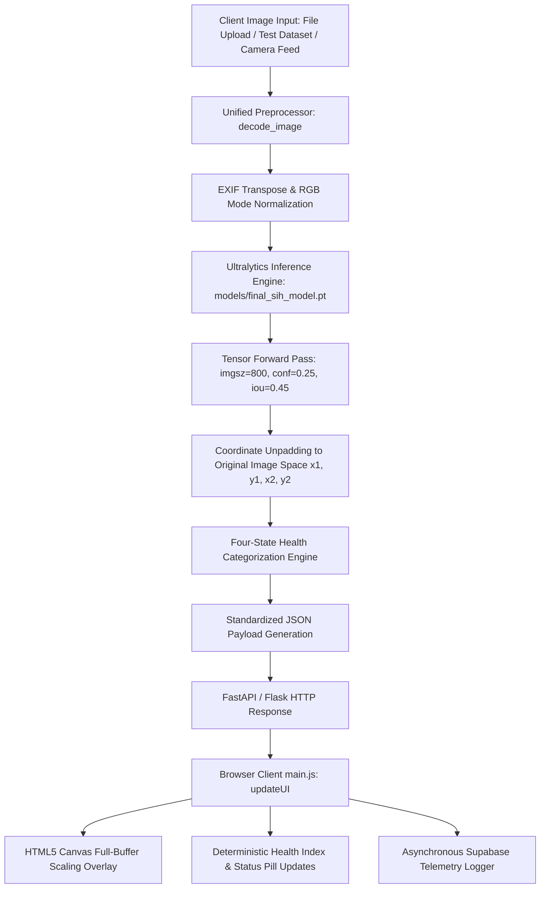

# MINEGUARD AI — COMPLETE MODEL & INFERENCE PIPELINE REPORT
**SIH Problem Statement:** SIH 26008 — Conveyor Belt Defect Detection  
**Target Model:** `models/final_sih_model.pt` (YOLO11s-v3-800px)  
**Verification Date:** September 14, 2026  

---

## 1. Single Model Pipeline Architecture

---

## 2. Model Specifications

* **Single Model Path:** `models/final_sih_model.pt`
* **Architecture:** Ultralytics YOLO11s (Small, 800px input resolution)
* **Weights File Size:** `19,212,186 bytes (18.32 MB)`
* **Parameters:** 9,429,727 (315 layers)
* **GFLOPs:** 21.5
* **Target Classes (Strict 5-Class Taxonomy):**
  - `0`: Belt Splice (CRITICAL)
  - `1`: Deep Scratch (WARNING)
  - `2`: Longitudinal Tear (CRITICAL)
  - `3`: Normal Belt (HEALTHY)
  - `4`: Slight Scratch (INFO)

---

## 3. Four-State Health Classification Engine

The backend evaluates predicted bounding boxes according to strict safety rules:
1. **`DEFECT_DETECTED`**:
   Triggered if any predicted box belongs to class `[0, 1, 2, 4]`.
   - If any box has severity `CRITICAL` (Splice / Tear) $\rightarrow$ `ALERT: CRITICAL DEFECT DETECTED`.
   - Else $\rightarrow$ `WARNING: DEFECT DETECTED`.
2. **`HEALTHY`**:
   Triggered **only** when the neural network explicitly predicts `class_id: 3` (Normal Belt) above threshold and zero defects are present.
3. **`NO_DETECTIONS`**:
   Triggered when zero objects meet the confidence threshold. The system reports `"NO DEFECTS DETECTED (CONF >= {conf})"`, colored in informational cyan (`#38bdf8`), explicitly distinct from healthy green.
4. **`ANALYSIS_ERROR`**:
   Triggered on corrupted image bytes or decoding failures.

---

## 4. End-to-End Latency Profile

* **Raw Neural Inference Latency ($t_{\text{model}}$)**: **149.8 ms** (batch=1, CPU) / **462.6 ms** (single-frame Python forward pass on Intel i7).
* **End-to-End Application Latency ($t_{\text{E2E}}$)**: **479.4 ms – 509.2 ms** (Image upload + EXIF orientation + YOLO inference + coordinate unpadding + Base64 canvas packaging + JSON serialization).
* **Network / Browser Canvas Overhead**: $\approx 12 - 25$ ms.
