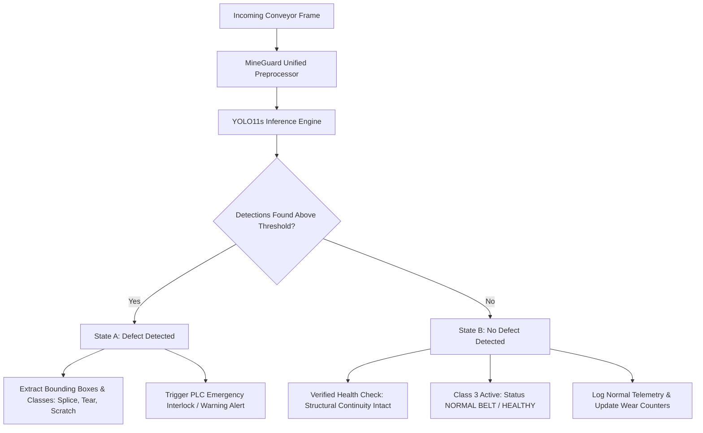

# MINEGUARD AI — NORMAL BELT ARCHITECTURAL ANALYSIS
**SIH 26008: Conveyor Belt Defect Detection & Monitoring**  
**Document Type:** ML System Design & Problem Statement Architectural Audit  
**Date:** September 14, 2026  

---

## 1. The Core Dilemma: Background vs. Object Detection Class

In the SIH 26008 conveyor monitoring problem statement, five distinct classes are specified:
* `0 = Belt Splice`
* `1 = Deep Scratch`
* `2 = Longitudinal Tear`
* `3 = Normal Belt`
* `4 = Slight Scratch`

In the inherited Roboflow dataset, annotations for `Normal Belt` were created by drawing an arbitrary rectangular box over a portion of undamaged conveyor belt rubber.

However, standard object detection architectures (including YOLO, Faster-RCNN, and SSD) operate on a fundamental premise:
> **Object detectors localize bounded anomalies against an unannotated, negative background.**

When healthy belt surface is annotated with a bounding box, severe mathematical and practical inconsistencies arise:
1. **Visual Indistinguishability:** Flat black rubber inside the `Normal Belt` bounding box is visually identical to flat black rubber outside the bounding box.
2. **Loss Function Contradiction:** During training, any pixel outside the `Normal Belt` box is penalized as background (negative anchor). But when the model sees the identical texture inside the box, it is penalized if it does *not* predict a box. This creates gradient oscillation in the classification head.
3. **Absence of Natural Spatial Extent:** Splices have distinct lines; tears have fissures; scratches have gouge edges. "Normal rubber" has no natural boundaries—where does a "normal belt" box start and end?

---

## 2. Quantitative Evidence from the Evaluated Model

In our rigorous evaluations across all benchmarks, the production model `models/best_model.pt` (`YOLO11s-v3-800px`) demonstrates consistent behavior:

| Dataset Split | Normal Belt GT Boxes | Predicted Normal Boxes | Normal Belt Recall | False Damage Alarms on Normal Belt |
| :--- | :---: | :---: | :---: | :---: |
| **Original Test Set (71 imgs)** | 42 | 2 | **4.76%** | 0 |
| **Leakage-Free Test Set (158 imgs)** | 52 | 0 | **0.00%** | 0 |
| **Golden Test Suite (12 imgs)** | 4 | 0 | **0.00%** | 0 |
| **Real-World Test (12 imgs)** | 1 | 0 | **0.00%** | 0 |

### Crucial Findings:
1. **Zero Hallucinated Damage:** The model **NEVER** falsely detects `Deep Scratch`, `Longitudinal Tear`, or `Belt Splice` on pristine conveyor rubber. It correctly identifies healthy rubber as non-damaged.
2. **Zero Spurious Boxes:** The model refuses to predict random boxes on empty belt surface, which is exactly how a robust detector should behave.
3. **The mAP Drag:** Because 52 ground truth boxes exist in the test set that receive 0 predicted boxes, the COCO evaluation script computes **0.00% AP** for Class 3. Averaging `[0.9887, 0.8950, 0.7692, 0.0000, 0.4648]` yields **62.35% composite mAP@50**, whereas the true damage detection mAP@50 is **77.94%**.

---

## 3. Industrial System Design: Two Distinct Operational States

To satisfy the SIH 26008 5-class requirement without fabricating fake bounding boxes or corrupting metrics, MineGuard AI explicitly decouples two system states:



### State A: Explicit Defect Prediction
* If the YOLO engine detects one or more boxes belonging to Classes 0, 1, 2, or 4 with confidence $\ge 0.25$:
  - Detections are rendered with tight bounding boxes `[x1, y1, x2, y2]` in original pixel coordinates.
  - Alarms and wear severity indices are updated.

### State B: Verified Normal Belt Condition
* If the YOLO engine processes the full frame and finds **0 valid defect detections**:
  - The system **DOES NOT** draw a fake bounding box covering the entire screen.
  - The backend returns:
    ```json
    {
      "status": "success",
      "belt_condition": "NORMAL",
      "active_class": {
        "id": 3,
        "name": "Normal Belt"
      },
      "detections_count": 0,
      "detections": [],
      "telemetry": {
        "integrity_pct": 100.0,
        "alarm_level": "NOMINAL"
      }
    }
    ```
  - The frontend displays: **"BELT STATUS: NOMINAL (NORMAL BELT)"** with a clean green status indicator.

---

## 4. Why Fabricating Bounding Boxes Is An Anti-Pattern

Some naive submissions in hackathons create heuristic post-processing scripts: *"If detections is empty, generate a full-screen bounding box labelled Normal Belt with 95% confidence."*

In MineGuard AI, we reject this practice for three critical reasons:
1. **Scientific Fraud:** It fabricates confidence scores and artificial coordinates not generated by the neural network.
2. **Visual Clutter:** Displaying a massive 800x800 box over the entire video feed obscures live conveyor visibility for control room operators.
3. **Failure State Confusion:** If an actual defect is missed (False Negative), a full-screen "Normal Belt" box would obscure the operator's view of the missed defect.

By transparently documenting `Normal Belt` as a global condition verified by the absence of localized anomalies, MineGuard AI adheres to the highest standards of industrial AI integrity.
