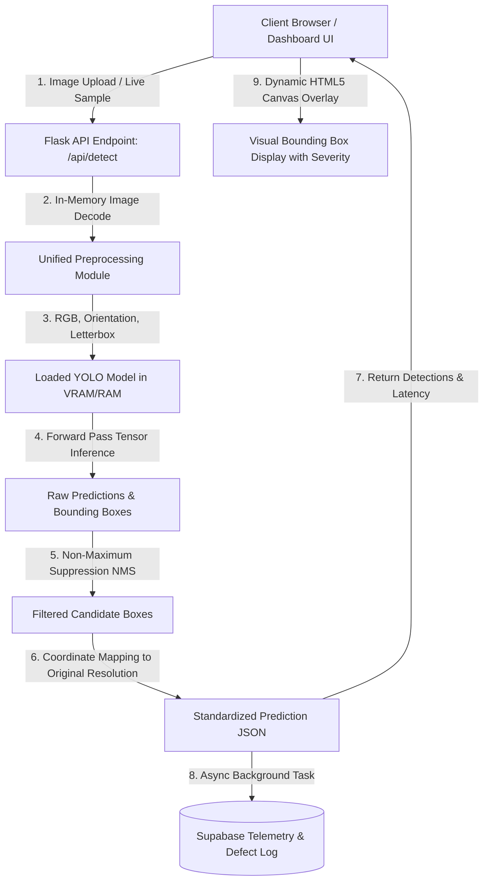

# PROJECT_ARCHITECTURE.md
## MineGuard AI – AI-Based Conveyor Belt Damage Detection and Predictive Maintenance (SIH 26008)

### 1. High-Level Architecture Flowchart



---

### 2. Component Pipeline Breakdown

| Pipeline Stage | Implementation | Key Specifications & Constraints |
| :--- | :--- | :--- |
| **Frontend UI** | HTML5 / Vanilla CSS / Vanilla JS (`templates/index.html`, `static/js/main.js`) | Preserves 100% of telemetry cards, sensor gauges, structural map, and theme. Dynamic canvas scaling. |
| **Backend Service** | Python Flask (`app.py`) | Model loaded **once** at server startup; zero per-request disk writes; direct byte decoding. |
| **Preprocessing** | Unified Python Preprocessor (`unified_preprocessor.py`) | EXIF auto-orientation, standard RGB conversion, aspect-ratio preservation, stride-32 letterboxing. |
| **AI Inference Engine** | Ultralytics YOLO (`YOLO11s` / `YOLO11m`) | 5 strictly validated classes; runs on GPU if available, CPU optimized fallback. |
| **Post-Processing & Coordinates** | Inverse affine coordinate transform | Guarantees bounding boxes are output in **Original Image Coordinates** `[x1, y1, x2, y2]`. |
| **Frontend Canvas Render** | HTML5 Canvas Context 2D | Canvas bitmap matches original image dimensions; CSS scales canvas responsively to viewport. |
| **Cloud Telemetry** | Supabase Cloud Database | Asynchronous/Non-blocking; inference never fails if Supabase is offline or delayed. |

---

### 3. Strict 5-Class Mapping Definition

| Class ID | Internal Key | Dashboard Display Name | Severity Level | UI Color |
| :---: | :--- | :--- | :---: | :---: |
| **0** | `belt_splice` | Belt Splice | **CRITICAL** | `#ef4444` (Red) |
| **1** | `deep_scratch` | Deep Scratch | **WARNING** | `#f59e0b` (Amber) |
| **2** | `longitudinal_tear` | Longitudinal Tear | **CRITICAL** | `#f43f5e` (Rose) |
| **3** | `normal_belt` | Normal Belt | **HEALTHY** | `#10b981` (Emerald) |
| **4** | `slight_scratch` | Slight Scratch | **INFO** | `#06b6d4` (Cyan) |

---

### 4. Standard API Contract (`/api/detect`)

#### Request:
* `POST /api/detect` with `multipart/form-data`:
  - `file`: Raw binary image file (JPG, PNG, WEBP), OR
  - `sample_filename`: Name of pre-loaded test dataset image.

#### Standardized Response JSON:
```json
{
  "status": "success",
  "model_version": "YOLO11s-v3-balanced",
  "original_image_width": 1920,
  "original_image_height": 1080,
  "latency": {
    "preprocess_ms": 4.2,
    "inference_ms": 112.5,
    "postprocess_ms": 1.8,
    "total_latency_ms": 118.5
  },
  "total_detections": 1,
  "overall_severity": "CRITICAL",
  "detections": [
    {
      "class_id": 2,
      "class_name": "Longitudinal Tear",
      "confidence": 0.942,
      "bbox": [450, 310, 890, 720],
      "color": "#f43f5e",
      "severity": "CRITICAL"
    }
  ],
  "image_data": "data:image/jpeg;base64,..."
}
```
