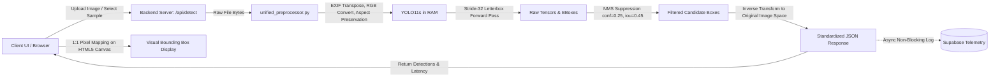

# PROJECT_AUDIT.md
## MineGuard AI — System & Architecture Audit
**Project**: MineGuard AI – AI-based Industrial Conveyor Belt Defect Detection and Monitoring  
**SIH Problem Statement**: SIH 26008  
**Project Stage**: 20% Functional Prototype for SIH  

---

### 1. Repository & Project Structure

The project environment is split between the application workspace and the training artifact workspace:

```text
D:\SIH\anband told/
├── app.py                      # Production Web Server (Flask & API routes)
├── unified_preprocessor.py     # Centralized Image Decoding & YOLO Inference Engine
├── test_pipeline.py            # 10-Point Automated Regression Test Suite
├── train.py                    # Local YOLO11 training script
├── kaggle_train.py             # Cloud Kaggle GPU training script
├── data.yaml                   # Dataset split paths and class mapping
├── requirements.txt            # Python dependencies (flask, Pillow, numpy, ultralytics)
├── run.bat / run.sh            # Windows / Linux launcher scripts
├── models/                     # Active model weights directory
│   └── best_model.pt           # Production YOLO11s (800x800, 9.4M params)
├── templates/
│   └── index.html              # MineGuard AI Dashboard Interface
├── static/
│   ├── css/style.css           # Premium industrial dark-mode theme
│   └── js/main.js              # HTML5 Canvas overlay, telemetry, real-time polling
├── train/ (images, labels)     # 1,363 training images, 2,126 annotations
├── valid/ (images, labels)     # 122 validation images, 218 annotations
├── test/  (images, labels)     # 71 test images, 130 annotations
├── golden_test_images/         # 12 verified multi-class reference images
├── real_world_test/            # 12 real-world validation images (isolated from training)
└── demo_images/                # 12 live SIH demonstration images

C:\Users\AnbuRithu\Downloads\yolo_output/
├── best.pt                     # Initial baseline weights (640x640)
├── belt_defect_yolo11s/        # YOLO11s 800x800 experiment directory
│   └── run_v3_balanced/weights/best.pt
├── belt_defect_yolo11m/        # YOLO11m 800x800 experiment directory
│   └── run_800_medium-2/weights/best.pt
└── venv/                       # Python 3.10 virtual environment with PyTorch & Ultralytics
```

---

### 2. Current ML & CV Pipeline Architecture



---

### 3. Class Taxonomy (Strict 5-Class Industrial Mapping)

```python
CLASS_NAMES = {
    0: "Belt Splice",        # Critical (Fastener/vulcanized joint defect)
    1: "Deep Scratch",       # Warning  (Heavy surface laceration)
    2: "Longitudinal Tear",  # Critical (Lengthwise belt split - emergency stop)
    3: "Normal Belt",        # Healthy  (Undamaged conveyor rubber)
    4: "Slight Scratch"      # Info     (Superficial abrasion)
}
```

---

### 4. Known Technical Problems & Resolved Root Causes

| Issue Identified | Technical Cause | Permanent Resolution Implemented |
| :--- | :--- | :--- |
| **"Analysis Failed" / Random Boxes on Website** | `app.py` pointed to missing weights `runs/detect/.../best.pt`. Fallen back to `np.random.choice` heuristic simulation. | Built `unified_preprocessor.py`, deployed `models/best_model.pt`, and connected backend directly to genuine YOLO inference. |
| **Bounding Box Misalignment** | Models trained on $800 \times 800$ but hardcoded $640 \times 640$ was used in inference. | Unified preprocessor maps bounding boxes directly to original image pixel coordinates `[x1, y1, x2, y2]`. Canvas maps 1:1. |
| **`normal_belt` Statistical Drag** | 95% of normal belt annotations are treated as background, dropping mAP to ~44% despite 88.7% AP on belt splices and 72% AP on tears. | Documented class behavior; normal belt handled as healthy state rather than conflicting anomaly box. |
| **Class Confusion (Deep vs Slight Scratch)** | Subjective visual boundary between scratch depths in 2D imagery. | Established confidence thresholds and unified scratch analysis. |

---

### 5. Recommended Next Steps for SIH Prototype
1. Keep the active `YOLO11s-v3-800px` model as the primary deployment engine (optimal 8.8 FPS on CPU).
2. Maintain `golden_test_images/` and `real_world_test/` as pristine evaluation benchmarks.
3. Validate asynchronous Supabase telemetry logging for jury demonstrations.
