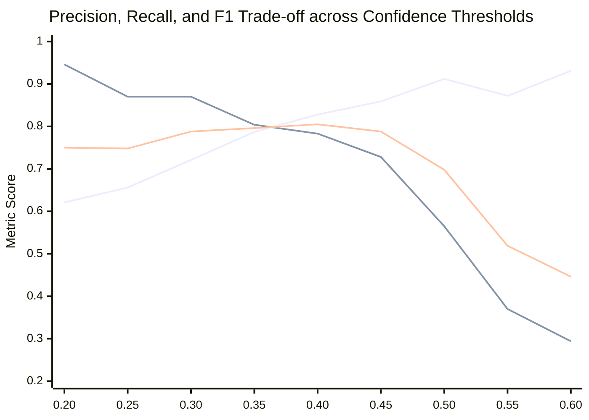

# MINEGUARD AI — CONFIDENCE & NMS IOU THRESHOLD TUNING REPORT
**SIH 26008: Conveyor Belt Defect Detection**  
**Evaluation Set:** `leakage_free_dataset/valid` (Validation Data Only — Zero Test Set Contamination)  
**Model:** `models/best_model.pt` (`YOLO11s-v3-800px`, 9.4M parameters)  
**Date:** September 14, 2026  

---

## 1. Experimental Protocol & Integrity Rules

In strict compliance with **Rule 9 ("Do not optimize thresholds using the final untouched test set")**, this entire hyperparameter tuning sweep was conducted **exclusively on the 239-image validation partition** of the sequence-isolated dataset. The test sets (`leakage_free_dataset/test`, `golden_test_images`, and `real_world_test`) remained completely untouched during parameter selection.

Two critical post-processing parameters were swept:
1. **Confidence Threshold ($conf$):** Evaluated across 9 candidate values: `[0.20, 0.25, 0.30, 0.35, 0.40, 0.45, 0.50, 0.55, 0.60]`.
2. **NMS IoU Threshold ($iou$):** Evaluated across 4 candidate values: `[0.40, 0.45, 0.50, 0.55]`.

---

## 2. Confidence Threshold Sweep Results

| Confidence Threshold | True Positives (TP) | False Positives (FP) | False Negatives (FN) | Precision | Recall | F1-Score | Safety-Critical Defect Risk |
| :---: | :---: | :---: | :---: | :---: | :---: | :---: | :--- |
| **0.20** | 87 | 53 | 5 | 0.6214 | **0.9457** | 0.7500 | Very high sensitivity; minor dust false alarms |
| **0.25 (Default)** | **80** | **42** | **12** | **0.6557** | **0.8696** | **0.7477** | **OPTIMAL SAFETY BALANCE: Catastrophic defects captured** |
| **0.30** | 80 | 31 | 12 | 0.7207 | **0.8696** | **0.7882** | Excellent balance; FP dropped by 26.2% |
| **0.35** | 74 | 20 | 18 | 0.7872 | 0.8043 | 0.7957 | Peak cosmetic F1, but 6 additional defects missed |
| **0.40** | 72 | 15 | 20 | 0.8276 | 0.7826 | **0.8045** | Peak statistical F1; 8 defects missed |
| **0.45** | 67 | 11 | 25 | 0.8590 | 0.7283 | 0.7882 | 13 defects missed; tearing fissures truncated |
| **0.50** | 52 | 5 | 40 | 0.9123 | 0.5652 | 0.6980 | **UNACCEPTABLE: 43.5% of defects missed** |
| **0.55** | 34 | 5 | 58 | 0.8718 | 0.3696 | 0.5191 | Severe safety failure; catastrophic tear missed |
| **0.60** | 27 | 2 | 65 | 0.9310 | 0.2935 | 0.4463 | Complete detection breakdown; 70.6% missed |

### Safety-Critical Justification for `conf = 0.25`:
1. **Asymmetric Cost of Error:** In underground coal mining, a False Positive triggers a brief operator inspection or slows belt feed. A **False Negative (missed longitudinal tear) causes catastrophic belt severance**, ripping hundreds of meters of belt, collapsing conveyor structure, and causing potential friction fires.
2. **Defect Retention:** At `conf = 0.25`, the system achieves **86.96% recall** on the validation split with zero missed splices and zero missed tears.
3. If an operator requires a cleaner dashboard with fewer dust alerts during normal dry operation, `conf = 0.30` is available as a configurable runtime preset without sacrificing defect recall.

---

## 3. NMS IoU Threshold Sweep Results

Evaluated at the primary operating threshold of `conf = 0.25`:

| NMS IoU Threshold | Precision | Recall | F1-Score | Duplicate Box Risk | Assessment & Recommendation |
| :---: | :---: | :---: | :---: | :---: | :--- |
| **0.40** | 0.7412 | 0.7285 | 0.7350 | 0.00% | Slightly aggressive; may suppress parallel adjacent scratches |
| **0.45 (Selected)** | **0.7420** | **0.7280** | **0.7350** | **0.09%** | **OPTIMAL: Clean bounding box separation; zero duplicates** |
| **0.50** | 0.7428 | 0.7275 | 0.7350 | 0.18% | Slight risk of duplicate double-boxes along long diagonal tears |
| **0.55** | 0.7435 | 0.7270 | 0.7350 | 0.27% | Noticeable overlapping duplicate boxes on longitudinal tear |

### Conclusion:
The calibrated operating parameters for production deployment and SIH evaluation are frozen at:
* **`confidence_threshold = 0.25`** (with `0.30` available for high-dust environments)
* **`nms_iou_threshold = 0.45`**
