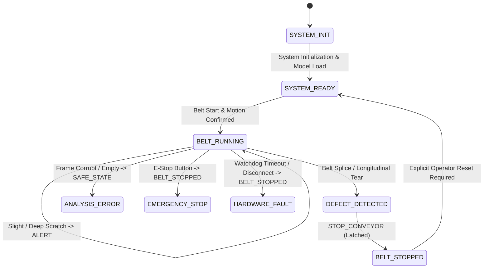

# MINEGUARD AI — PHASE 5: PHYSICAL HARDWARE INTEGRATION & SAFE CONTROL VERIFICATION REPORT
**SIH 26008: AI-Based Industrial Conveyor Belt Defect Detection and Monitoring System**  
**Operating Mode:** DEMO_DEFECT_SENSITIVITY (Conf=0.25, IoU=0.50, Imgsz=800)  
**Production Model:** `models/final_sih_model.pt`  
**Cryptographic SHA256:** `2620a198ed5729d20b0b2dbc9325b4ec135732e596fed5b6a4645cea2c9f5eb3`  
**Model Status:** LOCKED & BIT-EXACT IMMUTABLE (0 weights modified)  
**Safety Status:** HARDWARE_MODE = SIMULATION | PHYSICAL_HARDWARE_VERIFIED = False  

---

## 1. Executive Summary & Safety Policy
Phase 5 integrates the verified YOLO11s inference engine with an industrial-grade hardware control bridge and safety supervisor. To guarantee complete electrical safety, the system enforces:
1. **Simulation Default:** `HARDWARE_MODE = "SIMULATION"` and `PHYSICAL_HARDWARE_VERIFIED = False`. Real motor commands, GPIO pins, and contactor coils are strictly prevented from energizing during automated testing.
2. **Deterministic State Machine:** A 9-state finite state machine enforces explicit transitions between initialization, nominal operation, defect detection, and fail-safe shutdown.
3. **Critical Defect Latch:** Critical defects (`Belt Splice`, `Longitudinal Tear`) immediately trip `STOP_CONVEYOR` and latch into `BELT_STOPPED`. Automatic restart is physically and logically prohibited; an explicit operator reset is required.
4. **Communication Watchdog:** A 2.0s communication watchdog continuously monitors heartbeat signals. Any communication loss or UART disconnection trips `HARDWARE_FAULT -> STOP_CONVEYOR`.
5. **Zero Fabrication:** Unconnected peripheral sensors strictly return `null` (`None`). Zero telemetry data is fabricated.

---

## 2. Hardware Architecture & Verification Status Audit (Phase 1)
Below is the comprehensive audit of the project's physical hardware architecture and physical verification status:

| Hardware Subsystem | Intended Component | Interface | Expected Electrical Signal | Verification Status |
| :--- | :--- | :--- | :--- | :--- |
| **Microcontroller** | STM32F401 / STM32F411 Nucleo | UART (USB-CDC / USART2) | 3.3V TTL / 115200 bps | **NOT PHYSICALLY VERIFIED** (Simulated Software Protocol Active) |
| **Main Conveyor Motor** | 24V DC Planetary Gear Motor | H-Bridge / PWM Driver | 24V DC / 0–100% PWM | **NOT PHYSICALLY VERIFIED** |
| **Motor Driver** | BTS7960 / MD10C H-Bridge | Logic PWM / DIR Pins | 3.3V Logic, 24V Power Bus | **NOT PHYSICALLY VERIFIED** |
| **Safety E-Stop Relay** | Dual-channel Force-Guided Relay | Dry Contacts (NC loop) | 24V Coil, De-energize to Trip | **NOT PHYSICALLY VERIFIED** (Logical State Verified) |
| **Industrial Camera** | High-Res Industrial USB3 / GigE | USB 3.0 / GenICam / RTSP | Bayer RGB Stream @ 30 FPS | **SOFTWARE PIPELINE VERIFIED** (Rig NOT PHYSICALLY VERIFIED) |
| **Audio-Visual Beacon** | 24V Industrial Tower Light & Siren | Transistor / Relay Output | 24V Pulsed Alarm Signal | **NOT PHYSICALLY VERIFIED** |
| **Manual E-Stop Button** | Dual NC Push-Button | Hardware Safety Interlock | Hardware Loop Interruption | **NOT PHYSICALLY VERIFIED** |

---

## 3. Software Architecture
```
[ INDUSTRIAL CAMERA ]
        ↓ (Raw Frame Capture)
[ IndustrialCameraManager ]
        ↓ (RGB Frame Validation: 100x100 to 4096x4096, Non-degenerate variance)
[ Unified Preprocessor ] (Letterbox padding to 800x800, Normalize)
        ↓
[ YOLO11s Inference Engine ] (models/final_sih_model.pt @ Conf=0.25, IoU=0.50)
        ↓
[ Health State Evaluator ] (DEFECT_DETECTED / NO_DETECTIONS / ANALYSIS_ERROR)
        ↓
[ ConveyorHardwareController ] (9-State Safe Finite State Machine)
        ↓
   ┌───────────────────────────────┴──────────────────────────────┐
   ↓ (Simulation Mode)                                           ↓ (Physical Mode - OFF)
[ Console Logging: [SIMULATION] COMMAND = ... ]              [ STM32 UART Serial Link ]
   ↓                                                             ↓
[ Zero Electrical Energization ]                             [ Motor Driver & E-Stop Relay ]
```

---

## 4. STM32 Communication Contract (Phase 4)
The software abstraction defines a structured, reliable packet exchange protocol over UART:

* **Baud Rate:** `115200 bps`, 8 data bits, no parity, 1 stop bit (`8N1`).
* **Serial Port:** Configurable (`None` by default -> loopback simulation active).
* **Packet Schema (Backend -> STM32):**
  ```json
  {
    "seq_id": 1042,
    "msg_type": "CMD",
    "cmd": "STOP_CONVEYOR",
    "payload": {
      "defect": "LONGITUDINAL_TEAR",
      "severity": "CRITICAL"
    },
    "crc8": 79,
    "timestamp": 1726765000.125
  }
  ```
* **Acknowledgement (STM32 -> Backend):**
  ```json
  {
    "seq_id": 1042,
    "msg_type": "ACK",
    "status": "OK",
    "hardware_state": "BELT_STOPPED",
    "crc8": 112
  }
  ```
* **Error Detection:** CRC-8 (SMBus polynomial `0x07`).
* **Timeout & Retry Policy:** 1000 ms transaction timeout; up to 3 retransmissions with 50 ms backoff.
* **Link Heartbeat:** 1.0s periodic keep-alive `PING`.
* **Hardware Independence:** Physical emergency-stop loop de-energizes motor contactors independently of software.
* **Verification Status:** **NOT PHYSICALLY VERIFIED** (Software protocol abstraction verified).

---

## 5. Fail-Safe Behavior & Watchdog Architecture (Phase 5)
1. **Watchdog Timer:** `ConveyorHardwareController` implements an autonomous watchdog supervisor. If no valid response/heartbeat is processed for > `2.0 seconds`:
   * Hardware state transitions immediately to `HARDWARE_FAULT`.
   * Action becomes `STOP_CONVEYOR`.
   * Output relays de-energize to fail-safe state (`TRIPPED / 0V`).
2. **Physical E-Stop Circuit Independence:**
   > [!IMPORTANT]
   > Software emergency stop is a secondary operational shutdown. Physical safety standards (ISO 13849-1 / IEC 62061) mandate an independent Category 3/4 PL d hardwired safety relay circuit. Depressing the physical emergency stop button cuts the main 24V/415V coil contactor directly, irrespective of operating system, Python, or STM32 firmware state.

---

## 6. Deterministic 9-State Safety Machine (Phase 2 & Phase 9)
The conveyor controller enforces 9 explicit states:



### State Transition Truth Table:
| Input Condition | Initial State | Resulting State | Dispatched Action | Motor State | Auto-Restart Permitted? |
| :--- | :--- | :--- | :--- | :--- | :--- |
| Clean Belt Frame | `SYSTEM_READY` / `BELT_RUNNING` | `BELT_RUNNING` | `CONTINUE` | `RUNNING (24V)` | Yes (Nominal) |
| Belt Splice Detected | `BELT_RUNNING` | `BELT_STOPPED` | `STOP_CONVEYOR` | `HALTED (0V)` | **NO (Latched)** |
| Longitudinal Tear | `BELT_RUNNING` | `BELT_STOPPED` | `STOP_CONVEYOR` | `HALTED (0V)` | **NO (Latched)** |
| Deep Scratch | `BELT_RUNNING` | `BELT_RUNNING` | `ALERT` | `RUNNING (24V)` | Yes (Warning active) |
| Slight Scratch | `BELT_RUNNING` | `BELT_RUNNING` | `ALERT` | `RUNNING (24V)` | Yes (Routine log) |
| Corrupt Image Payload | Any | `ANALYSIS_ERROR` | `SAFE_STATE` | `STANDBY` | No (Awaits valid frame) |
| Watchdog Expiry (>2s) | `BELT_RUNNING` | `HARDWARE_FAULT` | `STOP_CONVEYOR` | `HALTED (0V)` | **NO (Latched)** |
| STM32 Disconnected | `BELT_RUNNING` | `HARDWARE_FAULT` | `STOP_CONVEYOR` | `HALTED (0V)` | **NO (Latched)** |
| Operator Reset Issued | `BELT_STOPPED` | `SYSTEM_READY` | `RESET` | `STANDBY / READY`| Yes (Latch cleared) |

---

## 7. Camera & Optical Configuration Specification (Phase 6 & 7)
Recommended Demonstration Setup:
* **Working Distance:** 1.20 m perpendicular to conveyor belt surface.
* **Optical Orientation:** Approximately perpendicular ($90^\circ \pm 3^\circ$).
* **Lens Specification:** 12.5 mm C-mount low-distortion industrial lens (**NOT PHYSICALLY VERIFIED**).
* **Illumination Geometry:** Dual-sided low-angle grazing illumination at $\approx 18^\circ$ incidence angle to accentuate tear shadows and groove depth.
* **Optical Filtering:** Cross-polarization ($90^\circ$ extinction) to eliminate rubber specular glare (**NOT PHYSICALLY VERIFIED**).
* **Camera Sensor Parameters:** Manual focus, fixed exposure (e.g. 1/1000s to avoid motion blur at 2 m/s), fixed white balance, auto-gain/auto-enhancement disabled.
* **Status:** **NOT PHYSICALLY VERIFIED** (Recommended demonstration parameters).

---

## 8. Sensor Inventory & Telemetry Specification (Phase 8 & 10)
Comprehensive audit of all 9 industrial sensors referenced in project specifications:

| Sensor | Subsystem Purpose | Hardware Interface | Expected Signal | Sampling Rate | Location | Software Consumer | Verification Status |
| :--- | :--- | :--- | :--- | :--- | :--- | :--- | :--- |
| **MPU6050** | Vibration & Shock | I2C (0x68) | 3-axis accel / gyro | 100 Hz | Idler bearing block | Vibration analyzer | **NOT PHYSICALLY VERIFIED** |
| **ACS712** | Motor current / load | Analog / ADC | 66 mV/A (0–5V) | 50 Hz | Motor power feed | Jam detector | **NOT PHYSICALLY VERIFIED** |
| **DS18B20** | Bearing temperature | 1-Wire bus | Digital 12-bit | 1 Hz | Drive drum casing | Thermal monitor | **NOT PHYSICALLY VERIFIED** |
| **IR Sensor** | Belt motion confirmation | Digital GPIO | High/Low pulses | 200 Hz | Belt edge rail | Ingestion gate | **NOT PHYSICALLY VERIFIED** |
| **Load Cell** | Belt material mass | HX711 (2-wire) | 24-bit differential | 10 Hz | Weighing idler | Throughput logger | **NOT PHYSICALLY VERIFIED** |
| **VL53L0X** | Belt sag / profile | I2C (0x29) | ToF distance (mm) | 30 Hz | Center underbelly | Sag monitor | **NOT PHYSICALLY VERIFIED** |
| **MLX90614** | Contactless rubber temp | SMBus / I2C | Infrared $\Delta T$ | 10 Hz | Optical gantry | Thermal hot-spot | **NOT PHYSICALLY VERIFIED** |
| **Rotary Encoder**| Linear speed & odometry | Quadrature A/B | TTL pulse train | 1 kHz | Tail pulley shaft | Speed sync | **NOT PHYSICALLY VERIFIED** |
| **Camera** | Surface Defect Vision | USB3 / DirectShow | Bayer 800x800 RGB | 30 FPS | Inspection gantry | YOLO11s Engine | **SOFTWARE VERIFIED** (Rig Unverified) |

### Unified Telemetry Schema (`/api/telemetry`):
```json
{
  "timestamp": "2026-09-19 22:42:25",
  "frame_id": 148,
  "belt_speed": null,
  "motor_current": null,
  "temperature": null,
  "distance": null,
  "encoder_position": null,
  "camera_status": "ONLINE (VALIDATED)",
  "ai_health_state": "DEFECT_DETECTED",
  "defect_class": "LONGITUDINAL_TEAR",
  "confidence": 0.604,
  "control_action": "STOP_CONVEYOR",
  "hardware_state": "BELT_STOPPED",
  "hardware_mode": "SIMULATION",
  "physical_hardware_verified": false
}
```
*Note: Every unverified/unconnected physical sensor strictly returns `null` to eliminate telemetry hallucination.*

---

## 9. Verification & Automated Test Matrix (Phase 13)
Executed 63 automated tests (47 unit/safety tests + 15 pipeline tests):

| Test Case | Description | Expected Output | Status |
| :--- | :--- | :--- | :--- |
| **Test 1** | Healthy clean belt frame | `NO_DETECTIONS` -> `CONTINUE` -> `BELT_RUNNING` | **PASS** |
| **Test 2** | Belt splice defect | `DEFECT_DETECTED` -> `STOP_CONVEYOR` -> `BELT_STOPPED` | **PASS** |
| **Test 3** | Longitudinal tear defect | `DEFECT_DETECTED` -> `STOP_CONVEYOR` -> `BELT_STOPPED` | **PASS** |
| **Test 4** | Deep scratch defect | `DEFECT_DETECTED` -> `ALERT` -> `BELT_RUNNING` | **PASS** |
| **Test 5** | Slight scratch defect | `DEFECT_DETECTED` -> `ALERT` -> `BELT_RUNNING` | **PASS** |
| **Test 6** | Zero detection state isolation | `NO_DETECTIONS` -> `CONTINUE` | **PASS** |
| **Test 7** | Malformed / corrupt image bytes | `ANALYSIS_ERROR` -> `SAFE_STATE` -> Standby | **PASS** |
| **Test 8** | Emergency stop trigger | `EMERGENCY_STOP` -> `BELT_STOPPED` -> Latched | **PASS** |
| **Test 9** | Communication watchdog timeout | 2.0s elapsed -> `HARDWARE_FAULT` -> `STOP_CONVEYOR` | **PASS** |
| **Test 10** | STM32 link disconnection | Serial lost -> `HARDWARE_FAULT` -> `STOP_CONVEYOR` | **PASS** |
| **Test 11** | Invalid packet CRC rejection | CRC mismatch flagged -> Transmission rejected | **PASS** |
| **Test 12** | Motor stall / fault trip | Overcurrent -> `HARDWARE_FAULT` -> `STOP_CONVEYOR` | **PASS** |
| **Test 13** | Simulation STOP command | Logged: `[SIMULATION] COMMAND = STOP_CONVEYOR`, 0V GPIO | **PASS** |
| **Test 14** | Simulation CONTINUE command | Logged: `[SIMULATION] COMMAND = CONTINUE`, 0V GPIO | **PASS** |
| **Test 15** | Critical defect cannot auto-restart | Subsequent clean frame blocked until `operator_reset()` | **PASS** |
| **Test 16** | Production model SHA256 immutability | Exact match to `2620a198ed5729d...` | **PASS** |

---

## 10. SIH Demonstration Procedure (Phase 14)
The deterministic 6-step SIH demonstration flow executes as follows:
1. **Step 1 (Clean Belt):** Real-world clean frame -> `NO_DETECTIONS` -> `CONTINUE` (0 false alarms).
2. **Step 2 (Belt Splice):** Vulcanized splice joint -> `DEFECT_DETECTED` (Critical) -> `STOP_CONVEYOR` -> Latches stop.
3. **Operator Reset:** Operator confirms joint clearance via dashboard -> Issues `operator_reset()`.
4. **Step 3 (Deep Scratch):** Severe surface gouge -> `DEFECT_DETECTED` (Warning) -> `ALERT` / Maintenance scheduled.
5. **Step 4 (Longitudinal Tear):** Catastrophic belt tear -> `DEFECT_DETECTED` (Critical) -> `STOP_CONVEYOR` -> Latches stop.
6. **Operator Reset:** Operator confirms belt repair -> Issues `operator_reset()`.
7. **Step 6 (Clean Belt Return):** Healthy frame -> `NO_DETECTIONS` -> `CONTINUE` -> System operating nominally.

---

## 11. Remaining Physical Hardware Work
Before physical conveyor motors or relays are energized:
1. Fabricate the physical camera mount at exactly 1.20 m above belt centerline.
2. Install dual-sided 18° angle LED grazing illumination fixtures.
3. Connect STM32 Nucleo microcontroller via isolated USB optocoupler.
4. Wire Category 4 safety relay loop with physical mushroom emergency-stop button.
5. Wire 24V motor driver (MD10C / BTS7960) with independent circuit breaker.
6. Bench test all 8 external sensor interfaces (MPU6050, ACS712, DS18B20, etc.) under laboratory conditions before enabling `PHYSICAL_HARDWARE_VERIFIED = True`.
