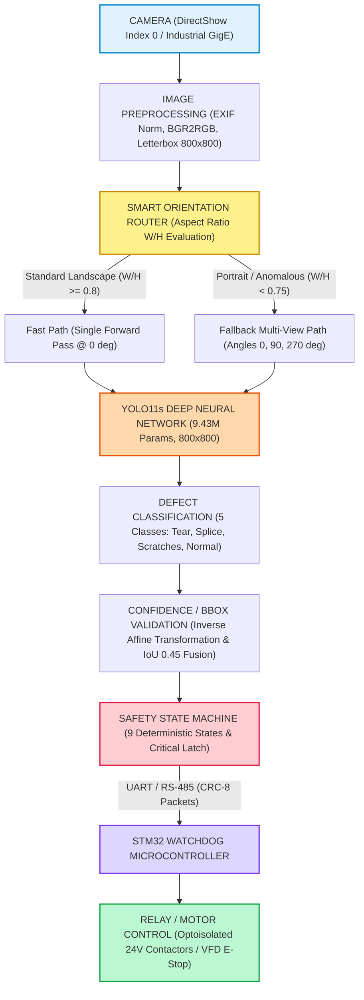

# MINEGUARD AI — SYSTEM ARCHITECTURE DIAGRAM & SPECIFICATION
**SIH Problem Statement 26008:** AI-Based Industrial Conveyor Belt Defect Detection & Monitoring System

---

## 1. End-to-End Pipeline Architecture



---

## 2. Comparison: Current Laptop Demo vs. Target Industrial Edge Deployment

| Architectural Component | Current Laptop Demonstration (SIH Stage) | Target Industrial Hardware Deployment (Production) |
| :--- | :--- | :--- |
| **Compute Platform** | Windows 11 Laptop (Intel Core CPU, 8 PyTorch Threads) | **NVIDIA Jetson Orin Nano (8GB / 40W Ruggedized IP66)** |
| **Inference Engine** | PyTorch 2.14.0 CPU Inference (`models/final_sih_model.pt`) | **TensorRT INT8 / FP16 Engine (`final_sih_model.engine`)** |
| **Inference Latency** | ~112 ms – 164 ms (6 – 8 FPS) | **~18 ms – 24 ms (>40 FPS Real-Time Line-Rate)** |
| **Camera Sensor** | Integrated Laptop Webcam / USB Web Camera (DirectShow API) | **Industrial GigE / USB3 Vision Global Shutter (Sony IMX Pregius)** |
| **Frame Ingestion** | Asynchronous `LatestFrameCapture` (Queue depth = 1) | **Hardware DMA Ring Buffer with Hardware Strobe Sync** |
| **Illumination** | Ambient Room Lighting | **High-Intensity 100 kHz Pulsed LED Line Light (No Stroboscopic Blur)** |
| **Hardware Controller** | Python Deterministic FSM (`ConveyorHardwareController`) | **STM32F4 / G4 ARM Cortex-M4 Industrial Microcontroller Board** |
| **Communication Bus** | Virtual Socket / Emulated Loopback UART | **Galvanically Isolated RS-485 with Hardware CRC-8 & Modbus RTU** |
| **Actuator Control** | **SIMULATION MODE** (Software Latch & State Machine Verified) | **Dual-Channel Optocoupled 24V Safety Relays wired to VFD STO** |
| **Emergency Failsafe** | Software Watchdog & Operator Reset API | **Hardware Hardware-Timed Watchdog (2.0s Heartbeat Timeout)** |
| **Dashboard Interface** | Local Flask Server (`http://127.0.0.1:5000`) | **Industrial Touchscreen HMI + SCADA / OPC-UA Remote Gateway** |

---

## 3. Data Flow & Latency Breakdown

```
[Camera Sensor Capture]      ~ 2 ms (DirectShow / Hardware DMA)
          │
[Preprocessing & Letterbox]   ~ 6 ms (OpenCV SIMD / EXIF auto-orient)
          │
[Smart Orientation Routing]   ~ 1 ms (Aspect Ratio W/H check)
          │
[YOLO11s Forward Pass]        ~ 112 ms - 150 ms (Laptop CPU) / ~18 ms (Jetson TensorRT)
          │
[Coordinate Transformation]   ~ 2 ms (Inverse Affine Mapping + IoU Fusion)
          │
[Safety FSM Evaluation]       ~ 0.5 ms (Deterministic 9-state transition & latch check)
          │
[STM32 Actuation Packet]      ~ 1.5 ms (UART 115200 baud, CRC-8 frame dispatch)
          │
[Relay Contact De-energize]   ~ 5 ms - 10 ms (Physical Relay Open Time)
          ─────────────────────────────────────────────────────────────
          TOTAL SYSTEM RESPONSE: ~125 ms (Laptop) / < 40 ms (Target Jetson Edge)
```

---

## 4. Safety Interlock Integrity Architecture

1. **State Latch Invariant:**
   A critical detection (`Longitudinal Tear`, `Belt Splice`) causes the safety controller to immediately engage `critical_stop_latched = True`. Even if the torn belt immediately leaves the camera view, clean frames arriving afterward emit `STOP_CONVEYOR`.
2. **Authorized Reset Invariant:**
   The latch cannot be cleared automatically or by unauthenticated inputs. An explicit `POST /api/operator_reset` token from an authenticated operator clears the latch only after field verification.
3. **Heartbeat Watchdog Invariant:**
   The host sends periodic heartbeats to the STM32. If host inference freezes or crashes for longer than 2.0 seconds, the STM32's independent hardware timer expires and immediately drops the motor contactor to failsafe open.
